# About Javascript
- It is synchronus single-threaded language.
  - **synchronus** : Each line waits for the previous one to finish
  - **single-threaded** : It can execute only one task at a time
- Everything happend in **Execution Context**
# About Execution Context
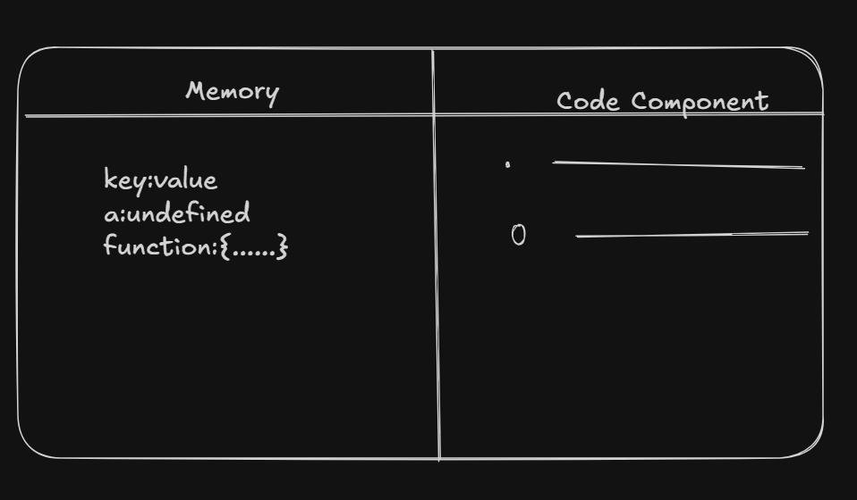
- Whenever code is run,EC get created
- Contains Two parts:
  - **Memory or Variable Environment** : all the functions and variale are stored in key:value format
  - **Code Component or Thread of Execution** : where code is Executed

# Execution of JS
*Refrence Code*:
```js
var n = 2;
function square(num){
  var ans = num*num;
  return ans;
}
var square2 = square(n);
var square4 = square(4);
```
The Execution Phase is divided into two phase:
### First Phase:
- **Memory Creation** :
  - The Control will go to all lines and identify the variables and functions and give the value.
  - **For variables** such as (n,square2,square4),it will give **undefined** value to these
   - **For Functions** such as (square),it will give **whole code written inside the function.**
   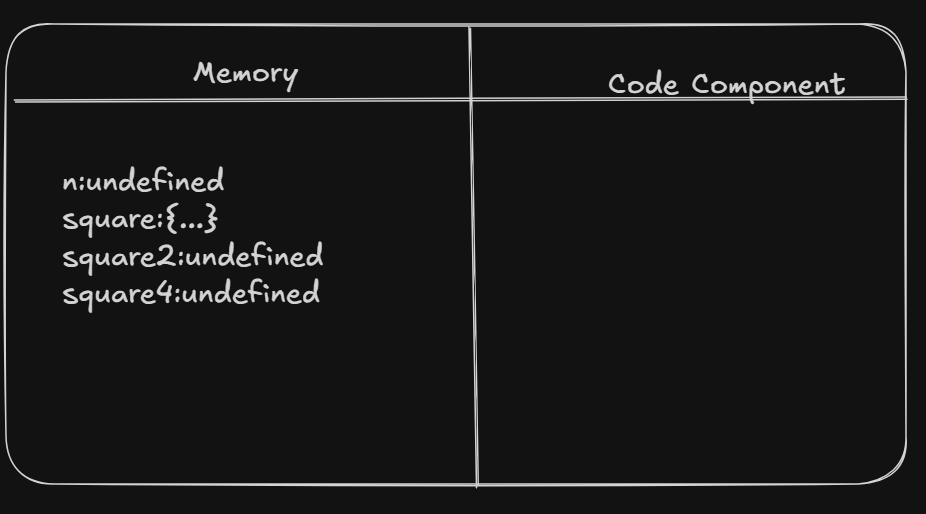
### Second Phase:
 - **Code Execution** :
    - Once again js will run the code line by line.
    - For Variables,it store it give the value of that variable to it
    - For the variables in which function is called or invoked (square2,square4),new EC get created.
    - EC for square2,is given below
  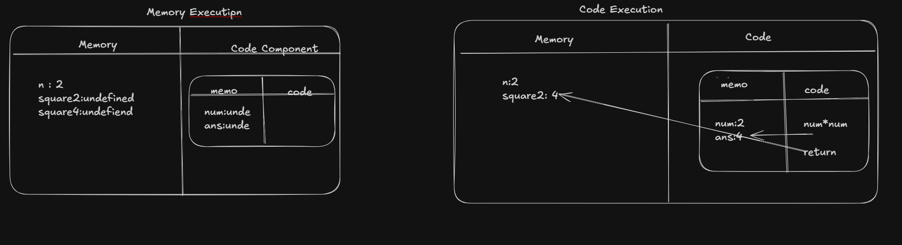
    - **Whenever Function is invoked,new EC get created,and same procedure of two phases executed.**
    - After the completion of function code (whenever **return** appears) the control will move to the that line where the function was invoked,and that **EC of function get destroyed**
### Call Stack:
- Its a stack which is used to handel the execution,creation and deletion of EC.
 - let GEC(Global Execution Context) be the main EC,EC1 for square2 and EC2 for square 4
 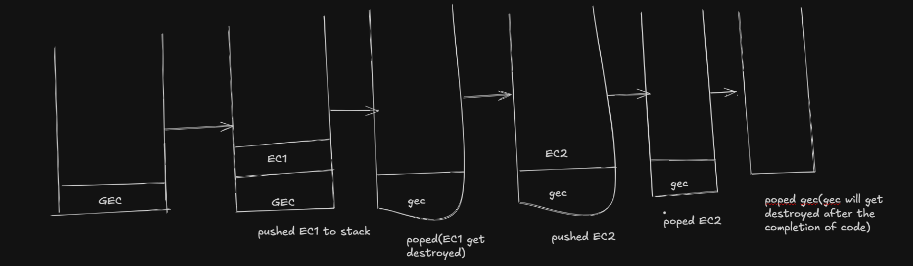
 - **After the execution of complete code, gec will get destroyed or deleted**
# Hoisting
- Hoisting means JavaScript **moves variable and function declarations to the top before running the code.**
- Example with codes:
```js
consol.log(x) 
var x = 10;
// Output: undefined
```
### **WHY?**
- its because of **hoisting**.
- *How Js sees that code:*
```js
var x;
consol.log(x) 
x = 10;
```

- Whenver the code start running ,before running it identifies all gloal variables and global functions and give the values(undefined and function) (Basically Memory Execution)
- so thats why when control move to second line ,it asked to print x,but in memory x is defined as undefined,there is no value stored in it.Value is stored(Initialization) in 3rd line.
## About Scope
- *Code Example1 :*
```js
function f(){
  var y = 2;
  console.log(x);
}
var x = 10;
// Output: 10
// Here x and function f are global and y is local variable
```
- *Code Example: 2*
```js
function f(){
  console.log(x);
  var x = 10;
  console.log(x);
}
f();
var x = 10 // if we write this line or not output will be the same

// Output: undefined
//         10
// here 'x' defined in f is local variable 
```
## Hoisting of 'let' variables
- Initialization **is not done** in those variables whose types are **'let'**
- Hoisting is done
- In var variables , both are done
- *Code Example*
```js
console.log(x);
console.log(y);
let x = 10;
var y = 10;
// Output: ReferenceError: Cannot access 'x' before initialization
```
### TDZ(Temporal Dead Zone)
- The period from when a **let or const** variable is **hoisted (declared)** to when it is **initialized (assigned a value)**
- During this time, the variable exists in a **different space(Script)** where it cannot be accessed until it is assigned a value.
# var vs let vs const
- **var**:
  - It is is hoisted and not in TDZ(Temporal deadzone)
  - Can be re-declare and re-assign.
  - Global scope or function scope
  - window.variableName -> value
- **let**:
  - It is is hoisted and in TDZ(Temporal deadzone)
  - Can't be re-declare but can be re-assign.
  - Block Scope
  - window.variableName -> undefined
  - ***Code Example***
  ```js
  let a = 10;
  let a = 2; // redeclarion is not allowed
  console.log(a);
  // output:SyntaxError: Identifier 'a' has already been declared
  // let a;
  // a=10; (this is allowed,initialization can happend later)
  ```
- **const**:
  - It is is hoisted and in TDZ(Temporal deadzone)
  - Can't be re-declare and re-assign.
  - Block Scope
  - It should be defined or intialised at the time of declaration.
  - ***Code Example***:
  ```js
  const b; // it should be const b = 10,(declation and initialzation simaltaneosly)
  b = 10;
  console.log(b);
   // output: SyntaxError: Missing initializer in const declaration
  ```
# Lexical Environment
*Code*:
```js
function a(){
  var b = 10;
  c();
  function c(){
    console.log(c);
  }
}
a();
// Output:10
```
- **Local Memory + reference to lexical environment of its parent**
- Whenever EC(execution context) is executed,lexica environment is created
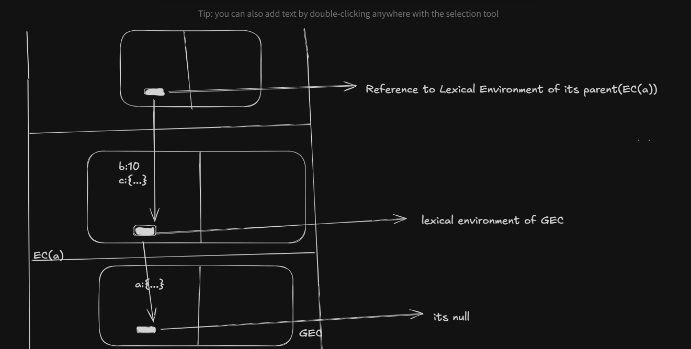
### Flow:
- all the execution context are created(GEC,EC(a),EC(b)) along with its lexical environment of its parent
- So first in EC(c),**js will try to find c in its local memory (basically in EC(c))**,but it would not find, it will go to lexical environment of its parent(basically to the local memory of EC(a))
- there it will find the b,get return to EC(b)
- If b was defined in GEC,the flow will get continued to lexical parent of a
- **Lexical Environment of GEC is null**
- **The whole chain of lexical environment is known as Scope Chain**
# BLOCK SCOPE

- *block* : Block contains multiple statements and can be used where js demand only one statmenet
- *fun fact* : if **if** statement , we used curely braces ,but but,these curley are not the part of **if**,they are block.
- *Example*:
```js
{
  var a = 100;
  let b = 3;
  const c = 4;
}
console.log(a); // 100
console.log(b); // b is not defined
console.log(c); // c is not defined
```
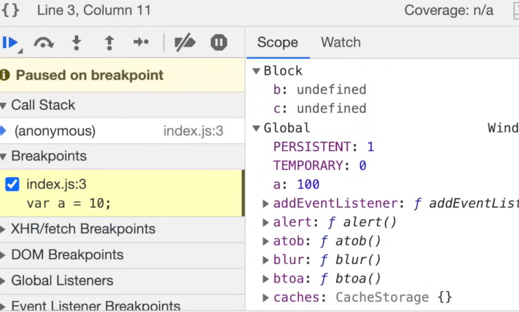
### WHY??
- Because b and c are sotred in seprate memory space or block
- Thats why **let and const are Block Scope**
- **var is Global Scope**
# Shadowing
- it means shadowing other values
*Example1*:
```js
var a = 10;
{
  var a = 20;
  let b = 30;
  let c = 40;
  console.log(a); // 20
}
console.log(a); // 20
```
### HOW?
- Beacuse 'a' defined inside block ,over shadowed value of 'a' defined outside of block
- Since 'var' is Globle Scope ,thats why both 'a's,points towards same memory

*Example2*:
```js
let b = 10;
{
  var a = 20;
  let b = 30;
  let c = 40;
  console.log(a); // 20
}
console.log(a); // 10
```
### HOW??
- **let** is a Block Scope,so it is stored in seprate memory,seprate block.
- now,the 'b' defined inside block,over shadowed the 'b' defined outside,but only for inside block
- outside of block , value of b is 10 only
- same thing happens with **const**

*Example3*:
```js
var b = 10;
{
  let b=20;
  console.log(b); // 20 ('let' only over shadowed value of 'b' inside block only)
}
console.log(b); // 10
```
*Example3*:
```js
let b = 10;
{
  var b=20;
  console.log(b); 
}
console.log(b); 
// SyntaxError: Identifier 'b' has already been declared
```
# Closure
- function + its lexical scope bundeled together to form closure
*Example*:
```js
function x(){
  var a = 10;
  function y(){
    console.log(a);
  }
  return y;// not just function y was returned, it's lexical enviornmet was also returned
}
var c = x(); // Function:y (legit whole function)
console.log(c);
c(); // 10
```
- ***FLOW :***
- First x get called ,both the phases get done,then x will get destroyed
- then y will get called,both the phases and  get destoryed
- x will return y , c will holds function y,
- Now when c will get called, basically y is getting called, it should print the value of y,but how?? since , its parent (x) is destroyed.
- So, when x returns y, it returns the function(y) and lexical scope of (y),thats why when c get called, the function y,remebers its parent , and print the value of a.

# SetTimeout
- setTimeout does **NOT pause JavaScript.**
It only says:
*“Run this function after at least X milliseconds.”*
- *syntax :*
  - setTimeout(fn, delay); (**in ms**)
- *Exampe :*
```js
function x(){
  setTimeout(function(){
    console.log(3,1000)
  },1000)
}
x();
console.log("Hello World");
//  Output:
//  Hellow World
//  3 (after 1000ms)
```
**"Time,Tide,js,waits for nothing"**
# Q: WAP in js to print numbers in following its time delay
- means , print 1 after 1 sec,2 after 2 sec...so on
- *Code :*
```js
function x(){
  for(var i=1;i<=5;i++){
    setTimeout(function(){
      console.log(i)
    },i*1000)
  }
}
// IT WILL PRINT 6, 5 TIMES
//  THIS IS TOTALLY WRONG
```
## WRONG WHY??
- 
## CORRECT CODE
- use 'let'
```js
function x(){
  for(let i=1;i<=5;i++){
    setTimeout(function(){
      console.log(i)
    },i*1000)
  }
}
```
# FUNCTIONS
- ### Important Terms
  - ### **Function Statement or Function Declaration :**
    - A function statement (also called function declaration) is a way to define a function using the function keyword with a name.
  - ### **Function Expression :**
    - A function expression is when a function is assigned to a variable.
- ### Diffrence between both in codes:
*Code1*
```js
function x(){ // Function Statement
  console.log("Hello");
}
var a = function (){ // Function Expression
  console.log("World");
}
x();
a();
```
Output:
Hello
World
*Code2*
```js
x();
a();
function x(){
  console.log("Hello");
}
var a = function (){
  console.log("World");
}
// TypeError: a is not a function
```
- JS treats a as normal variable
*Code3*
```js
x(); // Hello
console.log(a) // undefined
function x(){
  console.log("Hello");
}
var a = function (){
  console.log("World");
}
```
- since a is treated as a normal vairable,so memory is assigend for a in GEC as undefined (as we printing the value of a , before its declaration)
- ### Anonymous Function:
- An anonymous function is a **function without a name.**
- **anonymous functions must be used as a value.**
That means:
```js
function (){

}
```
- This code will give error: SyntaxError: Function statements require a function name
### **Named Function Expression**
- A Named Function Expression is a **function expression where the function has its own name.**
```js
var a = function b(){
  console.log(a);
}
a(); // Function:a
console.log(a); // Function:a
b(); // b is not defined
```
### **First Class Function**
- In JavaScript, functions are first-class citizens, meaning a function can be:
  - Stored in a variable
  - Passed as an argument
  - Returned from another function
  - Stored in data structures
```js
var a = function (){
  console.log("This function is stored in 'a' variable")
  return function(){
    console.log("This is returned from an function")
  }
}
var b(fn){
  fn();
}

a();
console.log(a())
b(function(){
  console.log("This function is passed as argument")
})
```
Output:
- This function is stored in 'a' variable
- This function is stored in 'a' variable
- [Function: xyz]
- This function is passed as argument
## CallBack
- A callback function is a function that is passed as an argument to another function and is executed later.
- *Basic Example :*
```js
function a(fn){
  fn();
}
a(function b(){
  console.log("B is call back function")
})
```
- *setTimeout Example :*
```js
function a(){
  setTimeout(function cb(){
    console.log("ehllo") // print hello after 3 sec
  },3000)
}
```
- *Event Listeners :*
```js
document.getElementById("clickme").addEventListener("click",function (){
  console.log("Button was clicked");
})
```
# WEB APIS
- Web APIs are browser-provided features that JavaScript uses to perform tasks outside the JS engine.Features: 
  - setTimeout() // not a part of js
  - DOM APIs (getElementsById, etc)
  - fech()
  - loalStorage
  - console
- These are not the part of js, js uses this features from browser
# EVENT LOOP
- A mechanism that allows the program to handle multiple tasks or **handle asynchronous operations like:(like user inputs, network requests, or timers)** without blocking the main thread.
- `Event loop decides when and which code get executed.`
 A mechanism that allows the program to handle multiple tasks (like user inputs, network requests, or timers) without blocking the main thread.

+ How it works ?
  - **Global Execution Context (GEC)**: As soon as JavaScript runs, a Global Execution Context `(GEC) is created` and `pushed onto the call stack`.

  - **Synchronous Code Execution**: JavaScript starts executing code line by line in a `synchronous manner`.

  - **Handling `setTimeout`**: When `setTimeout()` is encountered, JavaScript requests the `browser` to handle the timer using the `Web API`. The timer starts counting down.

  - **Handling `fetch`**: When `fetch()` is encountered, JavaScript requests the `browser` to perform the fetch operation using the `Web API`. The browser sends the request to the server for the API.
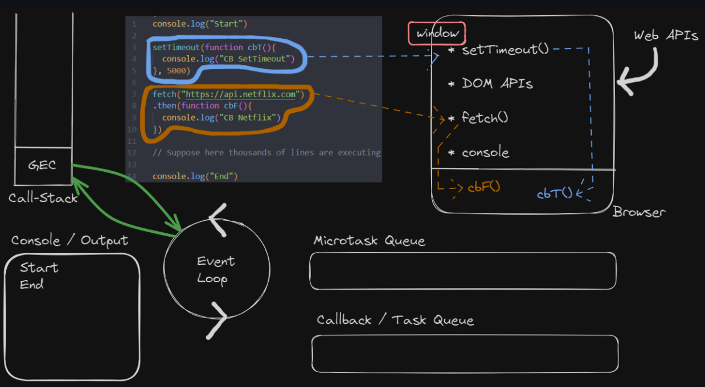
 - **Callback Queue and `setTimeout`**: After the timer completes, the callback function for `setTimeout` (let's call it `cbT`) is pushed to the `callback queue (also known as the task queue or macrotask queue)`.
    - The `callback queue` in JavaScript's event loop is where macrotasks (callbacks) are stored for execution. These tasks are generally `lower-priority` compared to microtasks and are `executed after all microtasks in the microtask queue have been processed`.
    - Types of Tasks in the Callback Queue:
      - `setTimeout`
      - `setInterval()`
      - `UI Rendering (DOM APIs)`

  - **Microtask Queue and `fetch`**: When the browser receives the API response, the callback function for `fetch` (let's call it `cbF`) is pushed to the `microtask queue (also known as the job queue)`.
    - The `microtask queu`e is a `priority queue` in the JavaScript event loop mechanism that `holds microtasks`, which are typically `high-priority tasks` that need to be `executed immediately after the current synchronous code and before any macrotasks (callbacks)` from the callback queue.
    - Types of Tasks in the Microtask Queue:
      - `Promises`
      - `Mutation Observer (A mechanism to listen for changes in the DOM)` 

- **Continuing Execution**: In the meantime, JavaScript continues executing the remaining synchronous code. Once all synchronous code has been executed, the `GEC is popped from the call stack`.
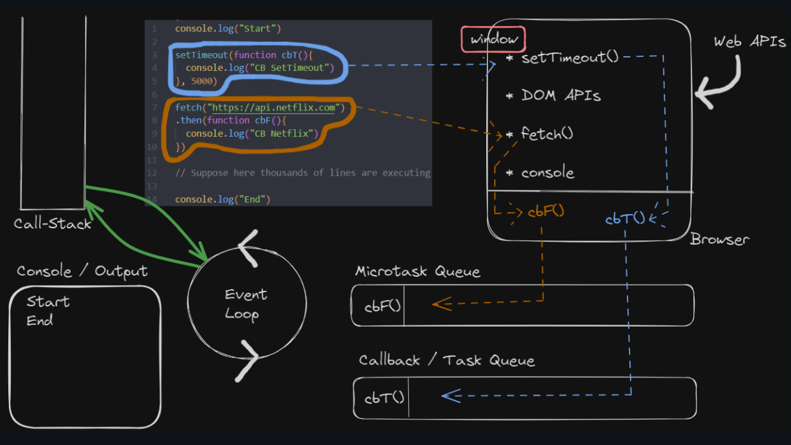
 - **Event Loop Operation**:
    - The `event loop continuously checks` if the call stack is empty.
    - If the `call stack is empty`, it `first checks the microtask queue`.
    - If there are tasks in the microtask queue, they are pushed to the call stack and executed.
    - After the `microtask queue is empty`, the `event loop checks the callback queue`.
    - If there are tasks in the callback queue, they are pushed to the call stack and executed.
  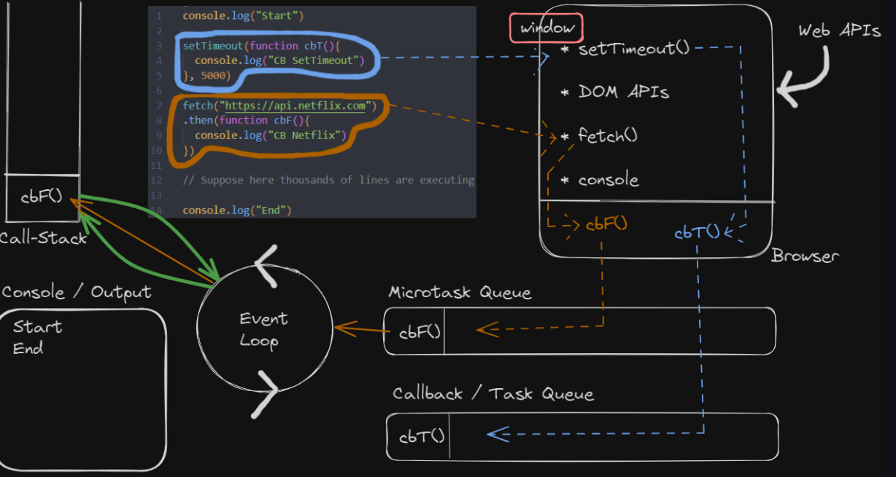
  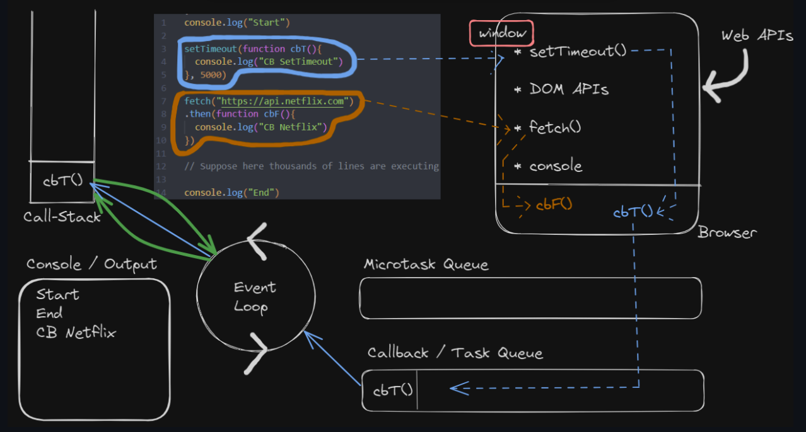
  - **Rechecking**: After executing a task from either queue, the event loop repeats the process:
    - It checks if the call stack is empty.
    - It checks the microtask queue first, and then the callback queue if the microtask queue is empty.
    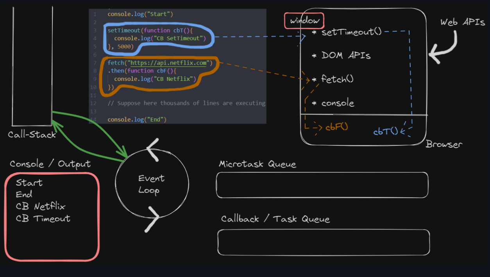
## High Order Functions:
- A `function` that takes `another function` as an `arguement` or `returns` a `function` from it.
```js
function x(){
  console.log("Hello")
}
function y(x){
  x()
}
// y is HOF
// x is callback function (x is passed as argument)
```
## Trust Issue with SetTimeout
 - SetTimeout states that it will `execute the function after atleast 'x' seconds`
 - Suppose delay is of 5000ms, and it requires 10sec to execute GEC,so callback function (which is need to execute after 5000ms) will execute after 10 sec when GEC will get executed
 - *Eample Code :*:
 ```js
 console.log("Start");
 setTimeout(function (){
  console.log("callback");
 },5000);
  console.log("end");
 let startDate = new Date().getTime();
 let endDate = startDate();
 while(endDate < startDate + 10000){ //  blocking main thread for 10 seconds
  endDate = new Date().getTime();
 } 
 console.log("whileExpires");
 ```
# map vs filter vs reduce
## **MAP :**
- map() is an array method that creates a `new array` by applying a function to `each element of an existing array`

- Use map() when you want a `transformed array`

- `syntax` : `arr.map(function())`
  - where  arr is given array and function() is a function.
          
          
- Ex: 
  - we have an array , and we want an array to have each values double of the given array
- *Code1 :* (To double every element)
```js
const arr = [5,2,3,7];
function double (el){
  return 2*el
}
const output = arr.map(double); // it will pass the 
// const output = arr.map(function double (el){
//   return 2*el; // will give the same output
// })
console.log(output); // [10,4,6,14]
```
- *Code2 :*(To find binary number of each element)
```js
const arr = [5,2,3,7];
function toBinary(el){
  return el.toString(2);
}
const output = arr.map(toBinary);
console.log(output); // [ '101', '10', '11', '111' ]
```
## filter: 
- filter() is an array method that creates a new array containing only those elements which satisfy a given condition.
- *Example*
```js
const arr = [1,2,3,4,5,6]
function isOdd(el){
  return el%2; // return True or False
}
const output = arr.filter(isOdd);
console.log(output); // [1,3,5]
```
## reduce
- reduce() is an array method that reduces multiple values into a `single value`
- *Example :* (To find sum of all numbers)
```js
let sum = 0;
const arr = [1,2,3,4,5];

for (let i = 0;i<=4;i++){
  sum+=arr[i];
}
console.log(sum) // 15
```

```js
const arr = [1,2,3,4,5];
const output = arr.reduce(function (acc,curr){
  acc=acc+curr;
  return acc;
},0)
console.log(output) // 15
```
- The `reduce` needs two parameters one is function and other is starting value which will be the the starting value of `acc` (just like `sum` , its starting value is 0)
- The function needs parameters `acc` and `curr`, curr have each element ,and acc will accumulate (basically it is `sum`).

## Chaining of map and filter
- let users = [
  { name: "Arnav", age: 20 },
  { name: "Riya", age: 25 },
  { name: "Aman", age: 17 }
];
- You need to print name whose age is greater than 18
- So,its a two step process:
- `step1 :` Use `filter` to get those users whose age is greater than 18
- `step2 :` Use `map` to get the name of those user
- *Code :*
```js
const users = [
  { name: "Arnav", age: 20 },
  { name: "Riya", age: 25 },
  { name: "Aman", age: 17 }
];
const req_users = users.filter(function (el) { // step-1
  return el.age > 18;
})
console.log(req_users); // [ { name: 'Arnav', age: 20 }, { name: 'Riya', age: 25 } ]
const output = req_users.map(function (el){
  // step-2
  return el.name;
})
console.log(output); // [ 'Arnav', 'Riya' ]
``` 
- You can combine both steps in a single step
```js
const users = [
  { name: "Arnav", age: 20 },
  { name: "Riya", age: 25 },
  { name: "Aman", age: 17 }
];
const output= users.filter(function (el) { // step-1
  return el.age > 18;
}).map(function (el){
  return el.name;
});
console.log(output); // [ 'Arnav', 'Riya' ]
```
# CallBack Hell
-   Callback function inside another callback function. 
- Structure is know as `pyramid of doom`
```js
api.createOrder(function (){
  api.proceedToPayment(function(){
    api.showOrderSummary(function(){
      api.updateWallet()
    })
  })
})
```
- Since proceedToPayemnt() is now handled by another function, i.e, createOrder().
- There may be a case in which bcs of some bugs createOrder function does not work, and bcs of this proceedToPayment which is an important function, will also not work
- In this way we looses our control to Javascript,as proccedToPayemnt function is totally depend upon createOrder function for its execution
- This is Known as `inversion of control`

- Solution-> `Promise`