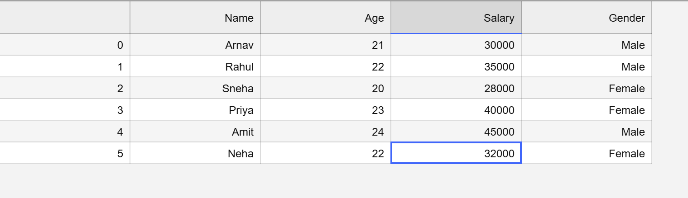
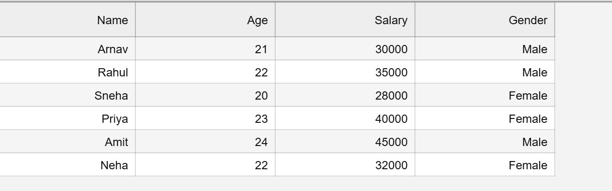

## Table of Contents

- [Introduction](#about-pandas)
- [DataFrame](#dataframe)
- [Creating DataFrame](#creating-dataframe)
- [head,tail,rename,info,describe](#headtailrenameinfodescribe)
- [save and load csv file](#save-and-load-data-from-csv)
- [Row and Column Selection](#row-and-coloumns-selection)
- [iloc vs loc](#iloc-vs-loc)

## About Pandas

- Pandas is a `Python library` used for `data manipulation` and `analysis`. It provides data structures like `Series` and `DataFrame` that allow users to store, organize, clean, and analyze structured data efficiently.

## Dataframe

- A DataFrame in Pandas is a two-dimensional, labeled data structure used to store and organize data in rows and columns, similar to a table or spreadsheet.

## Creating Dataframe

-use function : `DataFrame`

```py
df = pd.dataFrame([11,22,33])
df
type(df)
```

Output:

```py
	0 # since we have not mentioned column name,so it take as zero
0	11
1	22
2	33
pandas.core.frame.DataFrame
```

```py
df = pd.DataFrame([11,22,33],columns = ['col_name'])
df
```

Output:

```py
col_name
0	11
1	22
2	33

```

## head,tail,rename,info,describe

```py
data = {
    "Name": ["Arnav", "Rahul", "Sneha", "Priya", "Amit", "Neha"],
    "Age": [21, 22, 20, 23, 24, 22],
    "Salary": [30000, 35000, 28000, 40000, 45000, 32000],
    "Gender": ["Male", "Male", "Female", "Female", "Male", "Female"]
}
df = pd.DataFrame(data)
df
```

Output:

```py
Name	Age	Salary	Gender
0	Arnav	21	30000	Male
1	Rahul	22	35000	Male
2	Sneha	20	28000	Female
3	Priya	23	40000	Female
4	Amit	24	45000	Male
5	Neha	22	32000	Female

```

- `head :`
- Give the rows from top
- By default it will give `top 5` rows
- Ex: df.head(1)

```py
Name	Age	Salary	Gender
0	Arnav	21	30000	Male
```

- `tail :`
- Give the rows from Bottom
- By default it will give `bottom 5` rows
- Ex: df.tail()

```py
Name	Age	Salary	Gender
1	Rahul	22	35000	Male
2	Sneha	20	28000	Female
3	Priya	23	40000	Female
4	Amit	24	45000	Male
5	Neha	22	32000	Female
```

- `rename :`
- Use to rename column

```py
df1.renmae(columns = {'Gender':'Sex'})
df1
```

```py
Name	Age	Salary	Gender
1	Rahul	22	35000	Male
2	Sneha	20	28000	Female
3	Priya	23	40000	Female
4	Amit	24	45000	Male
5	Neha	22	32000	Female
```

- Now by default `inplace` is False,that means the changes will not effect in orignal DataFrame
- If it is True:

```py
df1.renmae(columns = {'Gender':'Sex'},inplace = True)
df1
```

Output:

```py
Name	Age	Salary	Sex
0	Arnav	21	30000	Male
1	Rahul	22	35000	Male
2	Sneha	20	28000	Female
3	Priya	23	40000	Female
4	Amit	24	45000	Male
5	Neha	22	32000	Female
```

- `info`
- Will give the summary of DataFrame

```py
df1.info()
```

```py
<class 'pandas.core.frame.DataFrame'>
RangeIndex: 6 entries, 0 to 5
Data columns (total 4 columns):
 #   Column  Non-Null Count  Dtype
---  ------  --------------  -----
 0   Name    6 non-null      object
 1   Age     6 non-null      int64
 2   Salary  6 non-null      int64
 3   Gender  6 non-null      object
dtypes: int64(2), object(2)
memory usage: 324.0+ bytes
```

- `describe`
- used to generate statistical summary of **`numerical columns`** in a DataFrame.

```py
df1.describe()
```

```py
Age	Salary
count	6.000000	6.000000
mean	22.000000	35000.000000
std	1.414214	6449.806199
min	20.000000	28000.000000
25%	21.250000	30500.000000
50%	22.000000	33500.000000
75%	22.750000	38750.000000
max	24.000000	45000.000000
```

- ## Save and Load data from csv

```py
df.to_csv('name.csv') # to save
loaded_df = pd.read_csv('name.csv') # to load/read
```



- This is csv file.since it also showing index as the first column,but we dont want it
- so: `df.to_csv('name.csv',index = False)`
- 
- ## Row and Coloumns Selection
- **`Columns Selection`**

```py
df[['Name']]
df[['Name','Age']]
```

```py
Name
0	Arnav
1	Rahul
2	Sneha
3	Priya
4	Amit
5	Neha


Name	Age
0	Arnav	21
1	Rahul	22
2	Sneha	20
3	Priya	23
4	Amit	24
5	Neha	22

```

- **'Row Selection'**
- 1. **Using `loc`** - Lable-based indexing
- To select only rows:

```py
df.loc[0:2] # Rows - > 0,1,2
```

```py
Name	Age	Salary	Gender
0	Arnav	21	30000	Male
1	Rahul	22	35000	Male
2	Sneha	20	28000	Female
```

- To select rows and columns:

```py
df.loc[0:2,['Name','Age']]
```

```py
Name	Age
0	Arnav	21
1	Rahul	22
2	Sneha	20
```

- 2. **Using `iloc`** : Integer position-based indexing
- To select only rows:

```py
df.iloc[0:2] # Rows -> 0,1
```

```py
Name	Age	Salary	Gender
0	Arnav	21	30000	Male
1	Rahul	22	35000	Male
```

- To select Rows and columns:

```py
df.iloc[0:2,1:]
```

```py
Age	Salary	Gender
0	21	30000	Male
1	22	35000	Male
```

## iloc vs loc

<!DOCTYPE html>
<html>
<head>
    <title>loc vs iloc</title>
    <style>
        table {
            border-collapse: collapse;
            width: 60%;
        }
        th, td {
            border: 1px solid black;
            padding: 8px;
            text-align: center;
        }
        th {
            background-color: #f2f2f2;
        }
    </style>
</head>
<body>
<table>
    <tr>
        <th>Feature</th>
        <th>loc</th>
        <th>iloc</th>
    </tr>
    <tr>
        <td>Meaning</td>
        <td>Label-based indexing</td>
        <td>Integer position-based indexing</td>
    </tr>
    <tr>
        <td>Uses</td>
        <td>Row/column names (labels)</td>
        <td>Row/column index numbers</td>
    </tr>
    <tr>
        <td>Index type</td>
        <td>Works with actual labels</td>
        <td>Works with numeric positions</td>
    </tr>
    <tr>
        <td>Slice behavior</td>
        <td>End index included</td>
        <td>End index excluded</td>
    </tr>
</table>

</body>
</html>

## Filtering

- To find Age greater than 18

```py
df['Age'] > 18
df[df['Age'] > 18]
```

Output:

```py
0    True
1    True
2    True
3    True
4    True
5    True
Name: Age, dtype: bool


Name	Age	Salary	Gender
0	Arnav	21	30000	Male
1	Rahul	22	35000	Male
2	Sneha	20	28000	Female
3	Priya	23	40000	Female
4	Amit	24	45000	Male
5	Neha	22	32000	Female
```

- To find whose name is Arnav

```py
df[df['Name'] == 'Arnav']
```

Output:

```py
Name	Age	Salary	Gender
0	Arnav	21	30000	Male
```

- To find whose age is even and greater than 22

```py
df[(df['Age'] % 2 == 0) & (df['Age'] > 22)]
```

Output:

```py
Name	Age	Salary	Gender
4	Amit	24	45000	Male
```

- To find rows whose name is Arnav or Rahul
- Way1:

```py
df[(df['Name'] == 'Arnav') | (df['Name'] == 'Rahul')]
```

- Way2: (Using - `isin()`)

```py
df[df['Name'].isin(['Arnav','Rahul'])]
```

Output:

```py
	Name	Age	Salary	Gender
0	Arnav	21	30000	Male
1	Rahul	22	35000	Male
```

- To find only Names whose age is between 20-24
- use `between()`

```py
df[df['Age'].between(20,24)].loc[:,['Name']]
```

```
Name
0	Arnav
1	Rahul
2	Sneha
3	Priya
4	Amit
5	Neha
```

## ADD,UPDATE,DELETE

- ### `Column`

- `Add`:

```py
df["City"] = ["Delhi","Mumbai","Bangalore","Pune","Chennai","Hyderabad"] # it should be no of values = no of rows
```

Output:

```py
Name	Age	Salary	Gender	City
0	Arnav	21	30000	Male	Delhi
1	Rahul	22	35000	Male	Mumbai
2	Sneha	20	28000	Female	Bangalore
3	Priya	23	40000	Female	Pune
4	Amit	24	45000	Male	Chennai
5	Neha	22	32000	Female	Hyderabad
```

- `Update`
- update the salray of first row

```py
df.loc[0,['Salary']] = df.loc[0,['Salary']] + 90000
```

Output

```py
Name	Age	Salary	Gender	City
0	Arnav	21	120000	Male	Delhi
1	Rahul	22	35000	Male	Mumbai
2	Sneha	20	28000	Female	Bangalore
3	Priya	23	40000	Female	Pune
4	Amit	24	45000	Male	Chennai
5	Neha	22	32000	Female	Hyderabad
```

- `Delete`

```py
df.drop("City",axis = 1)  # axis = 1 for column,do inplace = True to make changes
```

```
Name	Age	Salary	Gender
0	Arnav	21	120000	Male
1	Rahul	22	35000	Male
2	Sneha	20	28000	Female
3	Priya	23	40000	Female
4	Amit	24	45000	Male
5	Neha	22	32000	Female
```

### Row:

- `Add`:

```py
df.loc[len(df)]  = ["Riya", 21, 29000, "Female","Mumbai"] # Initially total length was 5 , so we have to append new row at index 5,bcs for length 5 indexes are from 0-4.
df.tail(1) # give the last row(recently added row)
```

```py
Name	Age	Salary	Gender	City
6	Riya	21	29000	Female	Mumbai
```

- Update
- Update Age of Rahul and print only that row

```py
df[df['Name'] == 'Rahul']
df.loc[df['Name'] == 'Rahul',['Age']] = 30
df[df['Name'] == 'Rahul']
```

```py
Name	Age	Salary	Gender	City
1	Rahul	22	35000	Male	Mumbai


Name	Age	Salary	Gender	City
1	Rahul	30	35000	Male	Mumbai
```
