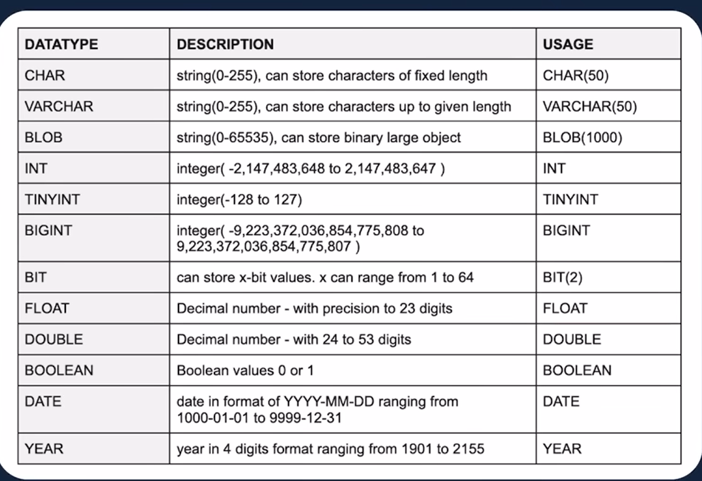
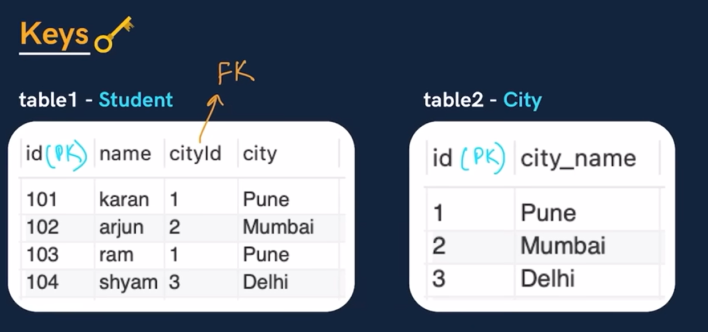
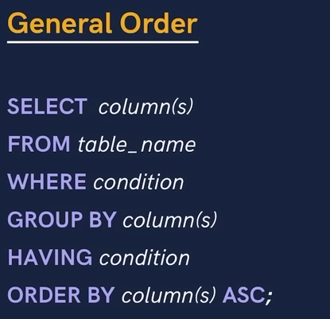

## Database

- Database is a collection of data in digital format which can be easily accessed

- A software application used to manage our DB - `Database Management System`

## Types of Database:

- `relational DB`:stores data in tables (rows and columns) and uses relationships (keys) to connect data between tables.
  `Ex`:MySQL, PostgreSQL, Oracle, SQL Server.
- `Non relational DB`: A Non-Relational Database (NoSQL) stores data in non-tabular formats like JSON, key-value, or graphs.
  `Ex`:MongoDB, Cassandra, Redis, Neo4j.

## SQL

- its a programming language used to interact with relational DB
- SQL (Structured Query Language) is used to create, read, update, and delete data in a relational database.

* **`Table`**:A collection of data stored in rows and columns (like a spreadsheet).
* **`Column`**: A vertical field that defines a data type (e.g., name, age).
* **`Row`**: A single record of data in the table (one complete entry).

### `NOTE: put `;` at the end of query`

## Create a Database

- Query:
  - `CREATE DATABASE college`
- creating a database ,whose name is `college`

### NOTE: its madantory to write `USE db_name` before creating tables or doing any query

## Create a Table

- syntax:
  - _create table table_name(
    **col_name** **datatype** **constraints**
    )_
- Query:
  - `CREATE TABLE STUDENT(
  id INT PRIMARY KEY,
  name VARCHAR(50),
  age INT NOT NULL
)`;
- we created a table whose name is `STUDENT`
- `id`,`name`,`age`,these are the coloumns of the table with the provided datatypes

### NOTE

- `We can wirte sql commands in lowercase letters also`

## SQL Datatypes

- 

### `CHAR` VS `VARCHAR`

- `CHAR`:Fixed length. Always uses full size.
- **Ex :** name CHAR(50)
- so if name is **arnav**,length is 5,but in memory 50 bytes has been alloted to `name` ,so the remaining space get wasted,thats why using `char` is ineffecient
- `VARCHAR`: Variable length. Uses only needed space
- **Ex :** name VARCHAR(50)
- so if name is **arnav**,length is 5,then only 5 bytes will get alloted to `name`,so it can use space upto 50
  Thats why use VARCHAR
- `we can use lowercase letters also for datatypes`

## Inserting some data`s

- **case 1 :** Inserting multiple datas
  - Query: - `INSERT INTO STUDENT (id,name,age) VALUES (1,"arnav",20),
(2,"Rathor",21)`;
- **cas 2 :** Inseting only single data(row)
  - Query:
    - `INSERT INTO STUDENT VALUES(1,"arnav",20)`;

### To read the table

- `Select`
- query: -`SELECT * FROM STUDENT`
- here `*` all coloumns,it will fetch all the rows and coloumns
- we can give `coloumns name` in place of _`_`\*

## Keys

- `Primary Key :`
  - It is a coloumn (or set of coloumns) in a table that `uniquely` identifies each row.
  - There is only `1` PK
  - It should `not` be `null`
- `Foreign Key :`
  - A foreign key is a coloumn (or set of coloumns) in a table that refers to the primary key to the other table
  - There can be `multiple` FKs
  - FKs can have `dublicate` and `null` values
    

## Constraints

- are `rules` applied to table `columns` to enforce `data integrity`.
- **Main types of constraints**:
  - `NOT NULL` – column cannot have NULL value
  - `UNIQUE` – all values must be different
  - `PRIMARY KEY` – uniquely identifies each record (NOT NULL + UNIQUE)
  - `FOREIGN KEY` – links one table to another table
  - `CHECK` – limits values based on condition
  - `DEFAULT` – sets a default value

## student

<table border="1">
  <tr>
    <th>rollno</th>
    <th>name</th>
    <th>marks</th>
    <th>grade</th>
    <th>city</th>
  </tr>
  <tr>
    <td>101</td>
    <td>anil</td>
    <td>78</td>
    <td>C</td>
    <td>Pune</td>
  </tr>
  <tr>
    <td>102</td>
    <td>bhumika</td>
    <td>93</td>
    <td>A</td>
    <td>Mumbai</td>
  </tr>
  <tr>
    <td>103</td>
    <td>chetan</td>
    <td>85</td>
    <td>B</td>
    <td>Mumbai</td>
  </tr>
  <tr>
    <td>104</td>
    <td>dhruv</td>
    <td>96</td>
    <td>A</td>
    <td>Delhi</td>
  </tr>
  <tr>
    <td>105</td>
    <td>emanuel</td>
    <td>12</td>
    <td>F</td>
    <td>Delhi</td>
  </tr>
  <tr>
    <td>106</td>
    <td>farah</td>
    <td>82</td>
    <td>B</td>
    <td>Delhi</td>
  </tr>
</table>

## WHERE clause

- WHERE clause is used to `filter rows` based on a `condition`.
- **Syntax**:
  - SELECT \* FROM table_name WHERE condition;
- Ex: select name from student where marks < 70;
- output:
- <table border="1">
    <tr>
      <th>name</th>
    </tr>
    <tr>
      <td>emanuel</td>
    </tr>
  </table>

### Operators

- Operators in SQL are used in WHERE clause to perform conditions and calculations
- Types of SQL Operators:
- `Arithmetic Operators`:
  - **+**(addition)

  - **-** (subtraction)

  - `*` (multiplication)

  - / (division)

- % (modulus)
- `Comparison (Relational) Operators`:
  - = equal

  - `!= or <> not equal`

  - `>` greater than

  - `<` less than

  - `>=` greater than or equal

  - `<=` less than or equal

- `Logical Operators`:
  - AND
  - OR
  - NOT
- `Special Operators`:
  - BETWEEN
  - IN
  - LIKE
  - IS NULL
  - IS NOT NULL
- `Bitwise Operators`:
  - &
  - |
  - ^
  - ~

### Some quereis:

- `In`
- select \* from student where city in ("Delhi","Mumbai");
- <table border="1">
    <tr>
      <th>rollno</th>
      <th>name</th>
      <th>marks</th>
      <th>grade</th>
      <th>city</th>
    </tr>
    <tr>
      <td>102</td>
      <td>bhumika</td>
      <td>93</td>
      <td>A</td>
      <td>Mumbai</td>
    </tr>
    <tr>
      <td>103</td>
      <td>chetan</td>
      <td>85</td>
      <td>B</td>
      <td>Mumbai</td>
    </tr>
    <tr>
      <td>104</td>
      <td>dhruv</td>
      <td>96</td>
      <td>A</td>
      <td>Delhi</td>
    </tr>
    <tr>
      <td>105</td>
      <td>emanuel</td>
      <td>12</td>
      <td>F</td>
      <td>Delhi</td>
    </tr>
    <tr>
      <td>106</td>
      <td>farah</td>
      <td>82</td>
      <td>B</td>
      <td>Delhi</td>
    </tr>
  </table>
- `BETWEEN`
- select \* from student where marks between 80 and 90;
- <table border="1">
    <tr>
      <th>rollno</th>
      <th>name</th>
      <th>marks</th>
      <th>grade</th>
      <th>city</th>
    </tr>
    <tr>
      <td>103</td>
      <td>chetan</td>
      <td>85</td>
      <td>B</td>
      <td>Mumbai</td>
    </tr>
    <tr>
      <td>106</td>
      <td>farah</td>
      <td>82</td>
      <td>B</td>
      <td>Delhi</td>
    </tr>
  </table>

### ORDER BY

- ORDER BY is used to `sort` the result set
- SELECT \* FROM table_name ORDER BY column_name ASC|DESC;
- select \* from student order by marks;
- <table border="1">
    <tr>
      <th>rollno</th>
      <th>name</th>
      <th>marks</th>
      <th>grade</th>
      <th>city</th>
    </tr>
    <tr>
      <td>105</td>
      <td>emanuel</td>
      <td>12</td>
      <td>F</td>
      <td>Delhi</td>
    </tr>
    <tr>
      <td>101</td>
      <td>anil</td>
      <td>78</td>
      <td>C</td>
      <td>Pune</td>
    </tr>
    <tr>
      <td>106</td>
      <td>farah</td>
      <td>82</td>
      <td>B</td>
      <td>Delhi</td>
    </tr>
    <tr>
      <td>103</td>
      <td>chetan</td>
      <td>85</td>
      <td>B</td>
      <td>Mumbai</td>
    </tr>
    <tr>
      <td>102</td>
      <td>bhumika</td>
      <td>93</td>
      <td>A</td>
      <td>Mumbai</td>
    </tr>
    <tr>
      <td>104</td>
      <td>dhruv</td>
      <td>96</td>
      <td>A</td>
      <td>Delhi</td>
    </tr>
  </table>
- by default is set to `ASC`(ascending order)

### Aggregate Functions

- Aggregate functions perform calculations on `multiple rows` and `return` a `single value`.
- Main Aggregate Functions in SQL:
  - COUNT() – counts rows
  - SUM() – adds values
  - AVG() – average of values
  - MIN() – smallest value
  - MAX() – largest value
- select count(\*) from student;
- <table border="1">
    <tr>
      <th>COUNT(*)</th>
    </tr>
    <tr>
      <td>6</td>
    </tr>
  </table>
- in place of `*` any coloumn name can also be written

### GROUP BY

- GROUP BY clause is `used` with `aggregate functions` to `group rows` that have the `same values` in a column
- Ex: we want to count the number of each cities
- <table border="1">
    <tr>
      <th>city</th>
      <th>count(city)</th>
    </tr>
    <tr>
      <td>Pune</td>
      <td>1</td>
    </tr>
    <tr>
      <td>Mumbai</td>
      <td>2</td>
    </tr>
    <tr>
      <td>Delhi</td>
      <td>3</td>
    </tr>
  </table>
- `IMP POINT` - whatever `coloumns` we have used before the using the aggregate functions,those coloumns should be writeen after `group by`

### HAVING clause

- HAVING clause is used to `filter groups` after `GROUP BY`.
- (Unlike WHERE, which filters rows).
  Ex: we want cities,whose max marks is greater than 90
- select city,max(marks) from student group by city having max(marks) > 90 order by max(marks);
- <table border="1">
    <tr>
      <th>city</th>
      <th>max(marks)</th>
    </tr>
    <tr>
      <td>Pune</td>
      <td>78</td>
    </tr>
    <tr>
      <td>Mumbai</td>
      <td>93</td>
    </tr>
    <tr>
      <td>Delhi</td>
      <td>96</td>
    </tr>
  </table>

- Ex: we want cities whose grades are 'A' and max marks is greater 90
- select city,grade,max(marks) from student where grade = "A" group by city having max(marks) > 90 ;
- <table border="1">
    <tr>
      <th>city</th>
      <th>grade</th>
      <th>max(marks)</th>
    </tr>
    <tr>
      <td>Mumbai</td>
      <td>A</td>
      <td>93</td>
    </tr>
    <tr>
      <td>Delhi</td>
      <td>A</td>
      <td>96</td>
    </tr>
  </table>
